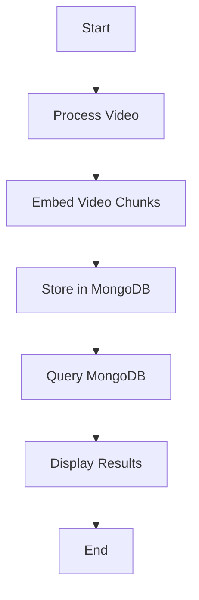

````markdown:use-cases/reverse-video-search/README.md
# Reverse Video Search

This project implements a reverse video search system using the Mixpeek API for video processing and embedding, and MongoDB for indexing and querying video chunks based on vector similarity.

## Features

- **Video Processing**: Extract frames from videos at specified intervals and resolutions.
- **Video Embedding**: Generate embeddings for video chunks using a pre-trained model.
- **Indexing**: Store embeddings in MongoDB with vector search capabilities.
- **Querying**: Find the most similar video chunks to a given query video using MongoDB's vector search.

## Requirements

- Python 3.8+
- `mixpeek`
- `pymongo`

You can install the necessary Python packages using:

```bash
pip install mixpeek pymongo
````

## Usage

1. Initialize the `Mixpeek` client and MongoDB collection with your API key and MongoDB URI.
2. Process a source video to extract and embed video chunks, then store these in MongoDB.
3. Query the MongoDB collection with another video to find similar video chunks.

Example:

```python
api_key = 'YOUR_API_KEY'
mongo_uri = 'YOUR_MONGO_URI'
db_name = 'demos'
collection_name = 'reverse_video_search'

mixpeek = Mixpeek(api_key)
collection = MongoClient(mongo_uri)[db_name][collection_name]

# Process and index video
video_index_url = 'https://example.com/source_video.mp4'
processed_videos = mixpeek.tools.video.process(
    url=video_index_url,
    frame_interval=20,
    resolution=[720, 1280],
    return_base64=True
)

for index, video in enumerate(processed_videos):
    response = mixpeek.embed.video(
        model_id="mixpeek/vuse-generic-v1",
        input=video['base64_string'],
        input_type="base64"
    )
    obj = {
        "start_time": video['start_time'],
        "end_time": video['end_time'],
        "embedding": response['embedding'],
        "file_url": video_index_url
    }
    collection.insert_one(obj)

# Query for similar video chunks
query_video_url = 'https://example.com/query_video.mp4'
response = mixpeek.embed.video(
    model_id="mixpeek/vuse-generic-v1",
    input=query_video_url,
    input_type="url"
)

query = [
    {
        "$vectorSearch": {
            "index": "vector_index",
            "path": "embedding",
            "queryVector": response['embedding'],
            "numCandidates": 10,
            "limit": 3
        }
    },
    {
        "$project": {
            "embedding": 0
        }
    }
]

search_results = list(collection.aggregate(query))
print(search_results)
```


