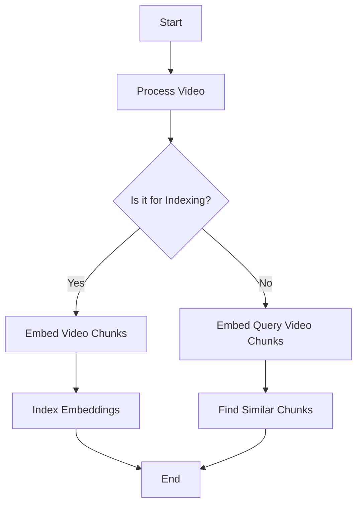

# Reverse Video Search

This project implements a reverse video search system using the Mixpeek API for video processing and embedding, and scikit-learn's k-Nearest Neighbors (kNN) for indexing and querying video chunks based on cosine similarity.

## Features

- **Video Processing**: Extract frames from videos at specified intervals and resolutions.
- **Video Embedding**: Generate embeddings for video chunks using a pre-trained model.
- **Indexing**: Store embeddings in a kNN model for efficient similarity searches.
- **Querying**: Find the most similar video chunks to a given query video.

## Requirements

- Python 3.8+
- `requests`
- `numpy`
- `scikit-learn`

You can install the necessary Python packages using:

```bash
pip install requests numpy scikit-learn
```

## Usage

1. Initialize the `VideoProcessor` with your API key.
2. Index video chunks from a source video.
3. Query the index with another video to find similar video chunks.

Example:

```python
api_key = 'YOUR_API_KEY'
video_url = 'https://example.com/source_video.mp4'
query_video_url = 'https://example.com/query_video.mp4'

processor = VideoProcessor(api_key)
processor.index_video_chunks(video_url) # Indexing video chunks
similar_chunks_indices, similar_chunks_distances = processor.find_similar_chunks(query_video_url)

print("Indices of similar chunks:", similar_chunks_indices)
print("Distances of similar chunks:", similar_chunks_distances)
```


